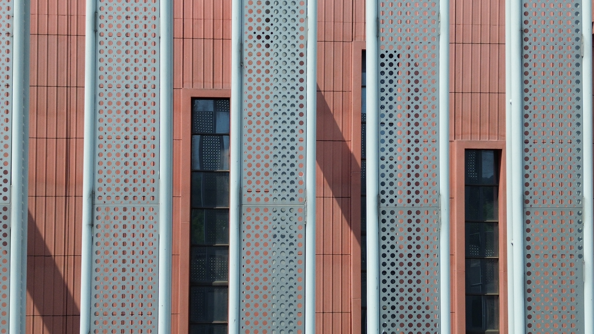
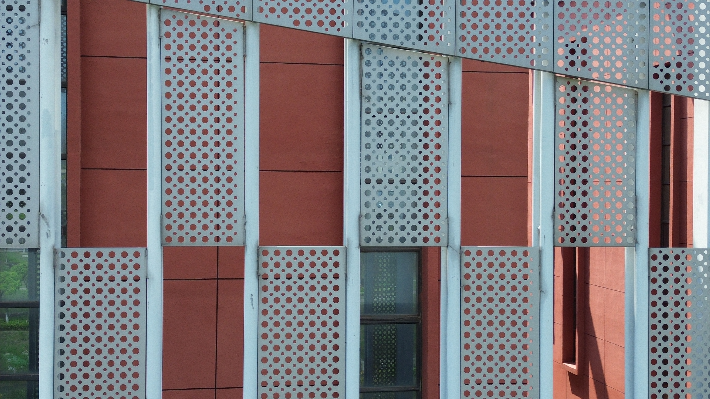
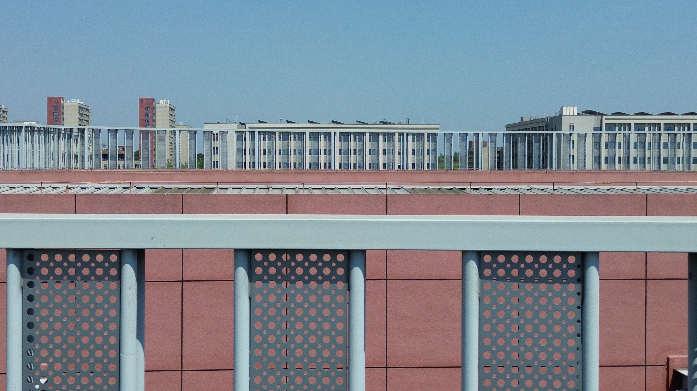
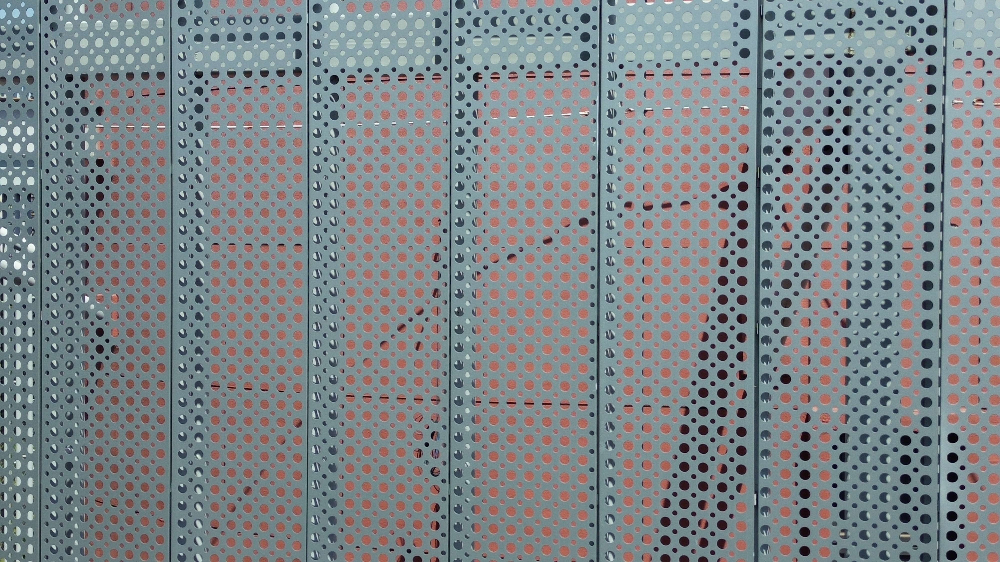

# Steel Construction Dataset

This repository contains a UAV image dataset of real-world steel construction scenes for structural defect research.

## Dataset Contents

- `data/`: 432 JPG images
- File naming format: `Steel_0001.JPG` to `Steel_0432.JPG`

## Image Examples

The examples below show representative UAV views from the dataset.

| Facade detail | Perforated steel screen | Rooftop view | Close-up screen panel |
| --- | --- | --- | --- |
|  |  |  |  |

## Notes

- No license has been assigned yet.
- 
## Organizer

Kang Yang , email : kyang16866@gmail.com  
Ruoyu Chen , email : chenruoyu@just.edu.cn
